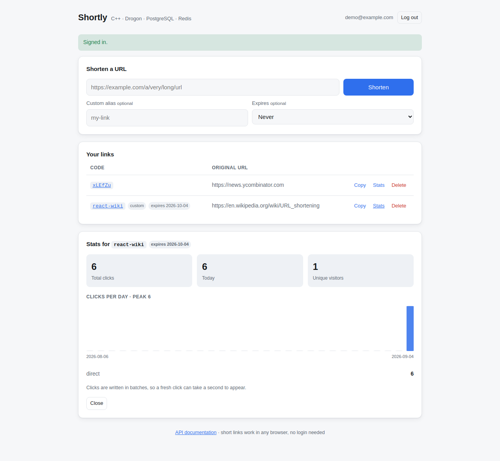

# URL Shortener

A production-style URL shortener backend written in modern C++.

Built incrementally in eight phases, each one adding a capability only after the
previous one worked: PostgreSQL, then Base62, then caching, auth, analytics,
tests, containers, and deployment.

**Stack:** C++17 · Drogon · PostgreSQL 17 · Redis 7 · Argon2id · JWT · GoogleTest · CMake · Docker · Nginx

---

## Web interface



React 18 + TypeScript, built with Vite. Sign up, shorten a URL with an optional
custom alias and expiry, copy it, view per-link click stats with a 30-day
chart, delete links.

```bash
cd frontend
npm install
npm run dev      # :5173, hot reload, proxies /api to :8081
npm run build    # emits into web/, which nginx and the app image serve
```

The bundle is 154 KB (50 KB gzipped). Charts are hand-drawn SVG rather than a
charting library, and there are no runtime dependencies beyond React itself.
It stores the token pair in `localStorage` and silently spends the refresh
token when a 15-minute access token expires, so a session survives without a
re-login.

Served from the same origin as the API on purpose: a page on another port would
be a cross-origin request and the browser would block it.

## Architecture

```
                         ┌──────────────┐
      Internet  ────────▶│    Nginx     │  TLS, rate limiting, security headers
                         │   :80 :443   │  overwrites X-Forwarded-For
                         └──────┬───────┘
                                │ frontend network
                         ┌──────▼───────┐
                         │  Drogon app  │  async event loop, C++17
                         │    :8080     │  (no published port)
                         └──────┬───────┘
                                │ backend network
                 ┌──────────────┴──────────────┐
                 │                             │
          ┌──────▼──────┐              ┌───────▼──────┐
          │    Redis    │              │  PostgreSQL  │
          │  cache-aside│              │ source of    │
          │  TTL 1h     │              │ truth        │
          │  LRU, no    │              │ named volume │
          │  persistence│              │              │
          └─────────────┘              └──────────────┘
```

### Request flow: `GET /1000`

```
   ┌──────────────┐
   │  GET /1000   │
   └──────┬───────┘
          ▼
   ┌──────────────┐   circuit open?   ┌──────────────┐
   │    Redis     │──────────────────▶│  bypass      │
   └──────┬───────┘                   └──────┬───────┘
      HIT │ MISS                             │
          │   └──────────┐                   │
          │              ▼                   │
          │      ┌──────────────┐            │
          │      │  PostgreSQL  │◀───────────┘
          │      └──────┬───────┘
          │             │ populate cache (SETEX, 1h)
          └──────┬──────┘
                 ▼
        ┌─────────────────┐
        │  302 + Location │  ← sent to the user FIRST
        └────────┬────────┘
                 ▼
        ┌─────────────────┐
        │ record click    │  ← async, never blocks the redirect
        └─────────────────┘
```

### Layers

```
controllers/   HTTP only: parse, validate, status codes
     │
filters/       JwtAuthFilter runs before protected controllers
     │
repositories/  all SQL; cache-aside lives here
     │
cache/         Redis + timeout + circuit breaker
     │
models/        plain structs, no framework types
```

Controllers never see `drogon::orm::Result`, and repositories never see HTTP.
Adding Redis in Phase 3 required **no controller changes at all**.

---

## API

| Method | Path | Purpose | Success |
|--------|------|---------|---------|
| GET | `/` | Web UI (nginx) · service name (app directly) | 200 |
| GET | `/health` | Liveness + real DB round trip | 200/503 |
| POST | `/api/auth/register` | Create account, returns JWT | 201/409 |
| POST | `/api/auth/login` | Exchange credentials for JWT | 200/401 |
| POST | `/api/auth/refresh` | Rotate refresh token, new access token | 200/401 |
| POST | `/api/auth/logout` | Revoke a refresh token (or all) | 204 |
| POST | `/api/urls` 🔒 | Create a short URL (optional `alias`, `expiresInDays`) | 201/409 |
| GET | `/api/urls` 🔒 | List your URLs (paginated) | 200 |
| DELETE | `/api/urls/{code}` 🔒 | Delete your URL | 204/404 |
| GET | `/api/urls/{code}/stats` 🔒 | Click analytics | 200/404 |
| GET | `/{shortCode}` | Redirect to the original URL | 302/404/410 |

🔒 requires `Authorization: Bearer <token>`

Full OpenAPI spec: [`docs/openapi.yaml`](docs/openapi.yaml).
Interactive docs at **`http://localhost:8081/docs/`** when running with Compose.
Swagger is proxied through nginx so it shares an origin with the API; calling
the API from a different port would be blocked by the browser as cross-origin.

```bash
TOKEN=$(curl -s -X POST http://localhost:8081/api/auth/register \
  -H 'Content-Type: application/json' \
  -d '{"email":"you@example.com","password":"correct-horse-battery"}' \
  | python3 -c 'import sys,json;print(json.load(sys.stdin)["accessToken"])')

curl -X POST http://localhost:8081/api/urls \
  -H 'Content-Type: application/json' -H "Authorization: Bearer $TOKEN" \
  -d '{"url":"https://example.com/a/very/long/url"}'
# {"shortCode":"1000","shortUrl":"http://localhost:8081/1000"}

curl -i http://localhost:8081/1000
# HTTP/1.1 302 Found
# location: https://example.com/a/very/long/url
```

---

## Quick start (Docker)

```bash
cp .env.example .env
# set DB_PASSWORD, JWT_SECRET, IP_HASH_SECRET — the app refuses weak secrets
openssl rand -hex 32

docker compose up -d
curl http://localhost:8081/health
```

Four services: nginx (published on 8081) → app → postgres + redis (internal
only). Postgres data lives in a named volume and survives `docker compose down`.

> The first build compiles Drogon from source and takes 10–20 minutes. Later
> builds reuse that layer and take seconds.

Hosting it publicly: [`docs/RENDER.md`](docs/RENDER.md) (managed, no server to
run) or [`docs/HOSTING.md`](docs/HOSTING.md) — VPS + DuckDNS + a
prebuilt image, step by step. General reference: [`docs/DEPLOYMENT.md`](docs/DEPLOYMENT.md).

---

## Local development (macOS)

Drogon **must be built from source**. The Homebrew bottle is compiled *without*
the PostgreSQL backend — it declares no `libpq` dependency, so the Postgres code
is silently excluded and every database call fails at runtime.

```bash
brew install cmake postgresql@17 redis jsoncpp c-ares brotli openssl@3 hiredis libsodium
brew services start postgresql@17
brew services start redis
export PATH="/opt/homebrew/opt/postgresql@17/bin:$PATH"

git clone --depth 1 --branch v1.9.13 https://github.com/drogonframework/drogon.git ~/src/drogon
cd ~/src/drogon && git submodule update --init --recursive --depth 1
cmake -S . -B build -DCMAKE_BUILD_TYPE=Release \
  -DCMAKE_INSTALL_PREFIX="$HOME/.local" \
  -DCMAKE_PREFIX_PATH="/opt/homebrew/opt/postgresql@17;/opt/homebrew/opt/openssl@3;/opt/homebrew" \
  -DBUILD_POSTGRESQL=ON -DBUILD_REDIS=ON -DBUILD_MYSQL=OFF
cmake --build build -j && cmake --install build
```

**Always verify a Drogon build actually linked the backends:**

```bash
otool -L ~/.local/lib/libdrogon.dylib | grep -E "pq|hiredis"   # Linux: ldd
```

Database (apply schema **as the app role** so it owns the tables and sequences):

```bash
psql -d postgres -c "CREATE ROLE urlshortener WITH LOGIN PASSWORD 'devpassword';"
psql -d postgres -c "CREATE DATABASE urlshortener OWNER urlshortener;"
for f in db/schema.sql db/migrations/*.sql; do
  psql -d urlshortener -U urlshortener -f "$f"
done
```

```bash
cmake -S . -B build && cmake --build build -j
./build/url_shortener
```

---

## Tests

```bash
cd build
ctest --output-on-failure     # 125 tests
ctest -L unit                 # 69 unit tests, no dependencies (~3s)
ctest -L integration          # 56 tests, needs Postgres + Redis
```

Integration tests use a separate database so they can truncate freely:

```bash
psql -d postgres -c "CREATE DATABASE urlshortener_test OWNER urlshortener;"
for f in db/schema.sql db/migrations/*.sql; do
  psql -d urlshortener_test -U urlshortener -f "$f"
done
```

| Suite | Count | Covers |
|---|---|---|
| Unit | 69 | Base62 (150k round-trips, injectivity, overflow), short-code permutation (bijectivity, non-adjacency), URL validation, JWT (`alg:none`, tampering, expiry, foreign secrets), Argon2id, IP hashing, refresh-token minting, alias validation and reserved words |
| Integration | 56 | Repositories against real Postgres/Redis, cache-hit vs cache-miss equivalence, full HTTP journey, cross-user authorization, refresh rotation and replay detection, click batching (escaping, concurrency, partial flush), aliases, expiry and 410, zero-filled daily series |

---

## Design decisions

**Permuted ids, then Base62.** The id is multiplied by a fixed constant modulo
62^6 before encoding. That is a bijection (the multiplier is coprime to the
modulus), so distinct ids still give distinct codes — no collision checks, no
retry loop — but consecutive ids scatter, so the code space cannot be walked.
Codes are a fixed 6 characters. `SHORTCODE_PERMUTE=false` restores plain Base62;
existing rows keep working either way because `short_code` is stored, not
recomputed.

**Custom aliases share one namespace with generated codes.** `short_code` is
`UNIQUE`, so `ON CONFLICT DO NOTHING` makes a taken code ordinary control flow
rather than an exception. The two cases then diverge deliberately: a custom
alias returns `409` because the user asked for *that* code, while a generated
code silently takes the next id and retries (bounded at 5 attempts). Aliases
that would shadow a real route — `api`, `docs`, `health` — are reserved.

**Expired links return `410 Gone`, not `404`.** The link existed and was
deliberately retired; crawlers drop a `410` from their index far faster. Cache
entries are capped at the link's remaining lifetime, so Redis can never outlive
the link it caches. An hourly job purges links expired beyond a grace period
and invalidates their cache entries.

**302, not 301.** A permanent redirect is cached by browsers indefinitely, which
would break click analytics and make a URL impossible to change or delete. The
cost — every click hits the server — is what Redis is for.

**Cache-aside, and the cache is never authoritative.** Redis holds a copy that
can always be rebuilt from Postgres. With `CACHE_ENABLED=false` redirects still
serve in ~2.7 ms. A 1 s client timeout plus a circuit breaker (3 failures → skip
Redis for 10 s) means a dead cache costs ~0.6 ms, not a 15 s hang.

**Short-lived access tokens plus revocable refresh tokens.** A JWT is stateless
and cannot be revoked, so access tokens last 15 minutes and a refresh token
(opaque 256-bit, stored only as a SHA-256) is exchanged at `/api/auth/refresh`.
Refresh tokens rotate on every use; replaying an already-rotated token is
treated as theft and revokes every session for that user.

**Click writes are batched.** Events buffer in memory and go out as a single
multi-row `INSERT` (via `UNNEST`) every 100 events or 1 second, whichever comes
first. One statement per click is the first thing to break under load. The
buffer is flushed on `SIGTERM` so a normal restart loses nothing.

**Analytics written after the response.** Measured over 400 requests:

| Mode | mean | p99 |
|---|---|---|
| async | 0.102 ms | 0.211 ms |
| sync | 0.216 ms | 0.527 ms |

Sync doubles the mean and 2.3× the p99. More importantly it couples a reporting
feature to the core redirect path. Analytics are statistical, not transactional.

**Argon2id, not SHA-256.** `m=65536` means 64 MiB per hash, so GPU cracking is
bounded by memory bandwidth rather than compute.

**IP addresses are keyed-hashed, never stored.** A plain SHA-256 would be
reversible — IPv4 has only 2³² values, hashable in minutes. HMAC with a
server-side secret makes that infeasible.

---

## How this would scale

Current design comfortably handles **~1,000 req/s** on one small VPS.

| Scale | Bottleneck | Change |
|---|---|---|
| 1k users | none | as-is |
| 100k users | redirect reads | already solved by Redis; add app replicas behind nginx |
| 1M users | single Postgres | read replicas for redirects; writes stay on the primary |
| 100M redirects/day (~1,200/s avg, ~5k/s peak) | click inserts, single DB | batch analytics writes or queue them; pre-aggregate hourly counters; partition `click_events` by month; consider sharding by short-code range |

Read/write ratio is extreme — roughly 100:1 to 1000:1 — which is why caching
matters far more than write optimisation. The app is stateless (JWT, no server
sessions), so horizontal scaling is just running more containers.

The first thing to break at high volume is **one INSERT per click**, not the
redirect path. Fix that by batching before anything else.

---

## Project layout

```
frontend/                 React + TypeScript source (Vite)
├── src/api.ts            typed client; refreshes and replays on 401
├── src/components/       AuthCard · CreateCard · UrlTable · StatsPanel · ClicksChart
└── public/docs/          Swagger UI shell
web/                      build output (gitignored)
src/
├── main.cpp              wiring only: config, DB pool, Redis, listen
├── controllers/          HealthController · UrlController · AuthController · AnalyticsController
├── filters/              JwtAuthFilter
├── repositories/         UrlRepository · UserRepository · AnalyticsRepository
│                         RefreshTokenRepository
├── services/             ClickBatcher
├── cache/                UrlCache (Redis + circuit breaker)
├── models/               UrlRecord · User · ClickEvent
├── middleware/           SecurityHeaders · RateLimit (standalone mode)
└── utils/                Config · Base62 · ShortCode · UrlValidator · AliasValidator
                          Password · Jwt · IpHash · Net · Migrations
.github/workflows/ci.yml  build + tests + docker smoke test + spec/compose lint
tests/
├── unit/                 no I/O
└── integration/          real Postgres + Redis + HTTP
db/
├── schema.sql
└── migrations/
nginx/                    nginx.conf (dev) · nginx.prod.conf (TLS)
scripts/                  init-letsencrypt.sh · backup.sh · restore.sh
docs/                     openapi.yaml · DEPLOYMENT.md
third_party/jwt-cpp/      vendored, header-only
```

---

## Configuration

All configuration is environment variables. `.env` is a local convenience;
real environment variables always win, which is how Docker and production
override it with no code change.

| Variable | Default | Notes |
|---|---|---|
| `APP_HOST` / `APP_PORT` | `127.0.0.1` / `8080` | `0.0.0.0` in containers |
| `DB_*` | | host, port, name, user, password, pool size |
| `DB_TIMEOUT_SEC` | `5` | query timeout; without it a dead DB hangs requests |
| `REDIS_*` | | host, port, TTL, pool size |
| `REDIS_TIMEOUT_SEC` | `1` | fail fast when Redis is unreachable |
| `REDIS_BREAKER_FAILURES` | `3` | failures before bypassing the cache |
| `CACHE_ENABLED` | `true` | `false` serves entirely from Postgres |
| `JWT_SECRET` | — | ≥32 chars; app refuses to start otherwise |
| `JWT_EXPIRY_MINUTES` | `15` | access token lifetime |
| `REFRESH_TOKEN_DAYS` | `30` | refresh token lifetime |
| `SHORTCODE_PERMUTE` | `true` | `false` gives plain sequential Base62 |
| `EXPIRY_CLEANUP_ENABLED` | `true` | hourly purge of long-expired links |
| `EXPIRY_GRACE_DAYS` | `7` | how long an expired link is kept before deletion |
| `ANALYTICS_BATCH` | `true` | batch click inserts |
| `ANALYTICS_BATCH_SIZE` | `100` | events per flush |
| `ANALYTICS_FLUSH_MS` | `1000` | max time an event waits in the buffer |
| `REDIS_RESOLVE_INTERVAL_SEC` | `30` | how often REDIS_HOST is re-resolved |
| `IP_HASH_SECRET` | — | rotating it invalidates historical unique counts |
| `ANALYTICS_MODE` | `async` | `sync` only for deterministic tests |
| `TRUST_PROXY_HEADERS` | `false` | `true` only behind a proxy that overwrites XFF |
| `STANDALONE` | `false` | `true` when there is no nginx: app serves the UI, headers and rate limits |
| `RUN_MIGRATIONS` | `false` | apply `db/` at start-up; `true` in Compose and Render |
| `RATE_LIMIT_ENABLED` | `false` | in-app rate limiting, for standalone deployments |
| `PORT` | — | set by PaaS platforms; takes precedence over `APP_PORT` |

---

## License

MIT
